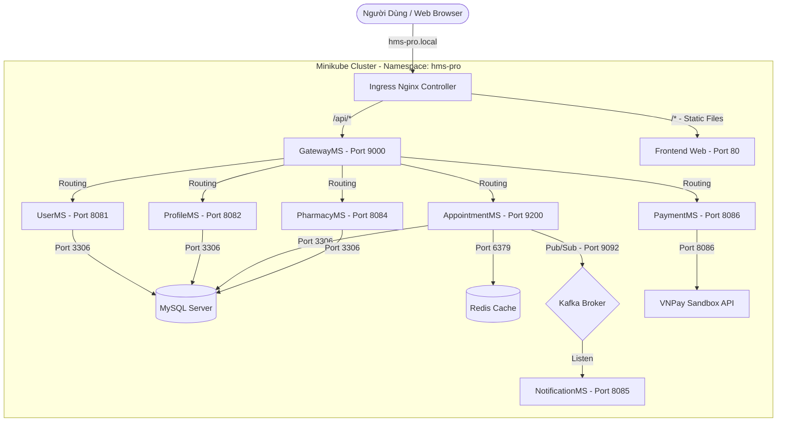
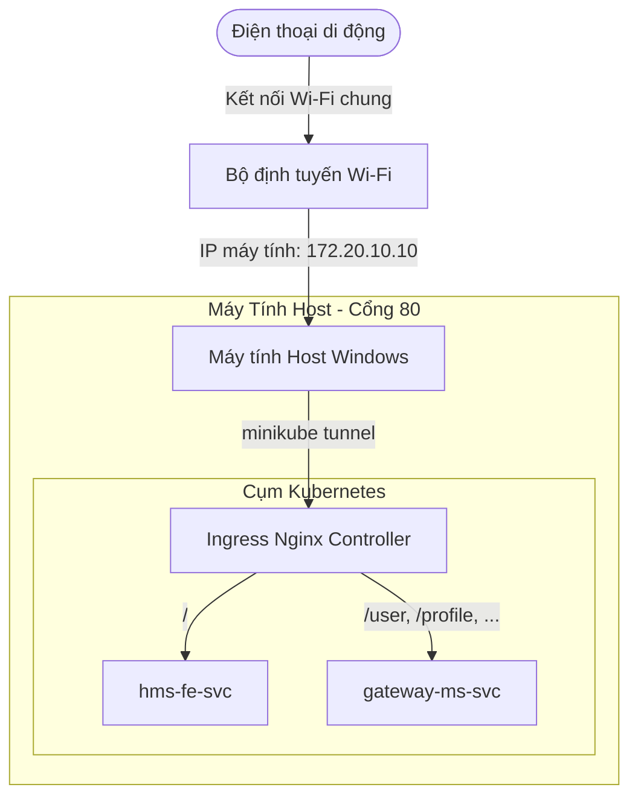
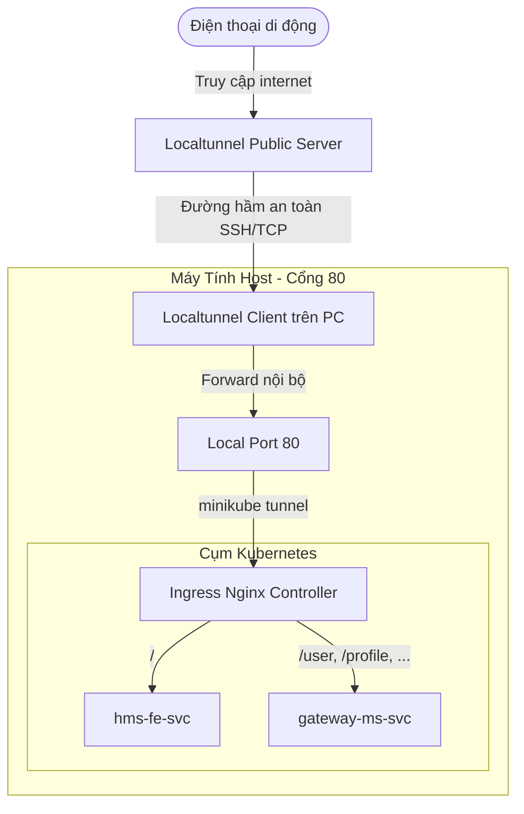

# Hướng Dẫn Chi Tiết: Di Chuyển Hệ Thống Microservices Lên Kubernetes & Minikube Trên Windows

Tài liệu này cung cấp toàn bộ quy trình, câu lệnh, sơ đồ kiến trúc, và các lỗi thường gặp kèm cách xử lý khi di chuyển hệ thống microservices từ môi trường chạy cục bộ (Local) lên mô hình Kubernetes sử dụng Minikube trên hệ điều hành Windows.

---

## 1. Sơ Đồ Kiến Trúc Hệ Thống (Kubernetes)

Dưới đây là mô hình định tuyến luồng dữ liệu của hệ thống HMS (Hospital Management System) khi được deploy hoàn chỉnh trong Minikube:



---

## 2. Các Giai Đoạn Di Chuyển Lên Kubernetes

### Bước 1: Chuẩn Bị File Docker Cho Từng Microservice
Trước khi chạy được trên Kubernetes, toàn bộ các services (Frontend, Gateway, Backend Services) phải được đóng gói thành Docker Image.

> [!NOTE]
> Với Quarkus/Spring Boot, sử dụng Multi-stage build hoặc copy trực tiếp JAR đã build từ host để tăng tốc độ đóng gói image.

Ví dụ Dockerfile tối ưu cho Quarkus (`GatewayMS/Dockerfile`):
```dockerfile
FROM eclipse-temurin:21-jre-alpine
WORKDIR /app
# Copy build artifact từ host
COPY GatewayMS/target/quarkus-app/ /app/quarkus-app/
EXPOSE 9000
# Cấu hình Garbage Collection và dung lượng Heap tối ưu cho Kubernetes
ENV JAVA_OPTS="-Xms128m -Xmx512m -Djava.util.logging.manager=org.jboss.logmanager.LogManager"
ENTRYPOINT ["sh", "-c", "java $JAVA_OPTS -jar /app/quarkus-app/quarkus-run.jar"]
```

---

### Bước 2: Khởi Chạy Minikube & Cài Đặt Môi Trường Trên Windows

1. **Khởi chạy Minikube** với tài nguyên RAM và CPU đủ lớn cho microservices (~9 services cần ít nhất 8GB RAM và 4 Cores):
   ```powershell
   minikube start --driver=docker --memory=8192 --cpus=4
   ```

2. **Kích hoạt Ingress Nginx Controller** (để định tuyến tên miền `hms-pro.local` thay vì dùng IP port):
   ```powershell
   minikube addons enable ingress
   ```

3. **Cấu hình trỏ tên miền (Hosts File)**:
   Mở file `C:\Windows\System32\drivers\etc\hosts` bằng quyền Administrator và thêm dòng sau:
   ```text
   127.0.0.1 hms-pro.local
   ```

---

### Bước 3: Biên Dịch Code & Đưa Image Vào Daemon Của Minikube

> [!IMPORTANT]
> **Điểm mấu chốt:** Không build image ở Docker Desktop của host Windows. Phải trỏ terminal về Docker Daemon bên trong Minikube để Kubernetes tìm thấy Image ngay mà không cần đẩy lên Docker Hub.

1. **Trỏ Docker CLI về Minikube (Powershell)**:
   ```powershell
   & minikube -p minikube docker-env --shell powershell | Invoke-Expression
   ```

2. **Biên dịch code toàn bộ hệ thống (Maven clean package)**:
   ```powershell
   # Build common library trước (nếu có)
   mvn -f hms-common/pom.xml clean install -DskipTests
   
   # Build các microservices
   mvn -f GatewayMS/pom.xml clean package -DskipTests
   mvn -f UserMS/pom.xml clean package -DskipTests
   # (Tương tự cho các service còn lại...)
   ```

3. **Build Docker Image trực tiếp trong Minikube**:
   ```powershell
   docker build -t hms/gateway-ms:latest -f GatewayMS/Dockerfile .
   docker build -t hms/user-ms:latest -f UserMS/Dockerfile .
   docker build -t hms/profile-ms:latest -f ProfileMS/Dockerfile .
   docker build -t hms/appointment-ms:latest -f Appointment/Dockerfile .
   docker build -t hms/hms-fe:latest -f hms-fe/Dockerfile ./hms-fe
   # (Tương tự cho các service còn lại...)
   ```

---

### Bước 4: Viết File Manifests (YAML) Cho Kubernetes

Hệ thống manifests nên phân chia rõ ràng để dễ quản lý:
1. `configmap.yaml`: Quản lý các biến môi trường cấu hình chung (URL của các service, Database connection string).
2. `secret.yaml`: Chứa các mật khẩu nhạy cảm mã hóa Base64.
3. `services/`: Chứa định nghĩa Deployment và Service cho các Database/Middleware (MySQL, Redis, Kafka).
4. `services/` (microservices): Định nghĩa deployment cho ứng dụng Java/JS của bạn.
5. `ingress.yaml`: Bản đồ định tuyến traffic từ cổng `hms-pro.local` vào các Service tương ứng.

#### Cấu hình mẫu Deployment cho Microservice:
```yaml
apiVersion: apps/v1
kind: Deployment
metadata:
  name: user-ms
  namespace: hms-pro
spec:
  replicas: 1
  selector:
    matchLabels:
      app: user-ms
  template:
    metadata:
      labels:
        app: user-ms
    spec:
      containers:
        - name: user-ms
          image: hms/user-ms:latest          # Sử dụng image local đã build trong daemon
          imagePullPolicy: IfNotPresent      # Quan trọng: K8s không cố pull từ internet
          ports:
            - containerPort: 8081
          env:
            - name: SPRING_DATASOURCE_URL
              value: "jdbc:mysql://mysql-svc:3306/hms_user" # DNS nội bộ của Kubernetes
          resources:
            limits:
              cpu: "500m"
              memory: "512Mi"
            requests:
              cpu: "100m"
              memory: "128Mi"
```

---

### Bước 5: Khởi Chạy Và Sửa Lỗi Tương Thích Nginx Ingress Trên Windows

Thông thường trên Windows, Ingress Controller của Minikube chạy dưới dạng NodePort và không tự động bind vào cổng `80/443` của localhost. Do đó ta cần cấu hình patch để có thể truy cập `hms-pro.local` trực tiếp:

1. **Deploy toàn bộ tài nguyên bằng Kustomize hoặc Kubectl**:
   ```powershell
   kubectl apply -k k8s/
   ```

2. **Patch Ingress Controller sang dạng LoadBalancer**:
   ```powershell
   kubectl patch service ingress-nginx-controller -n ingress-nginx -p '{"spec":{"type":"LoadBalancer"}}'
   ```

3. **Chạy Minikube Tunnel** (Luôn giữ terminal này mở khi dùng ứng dụng):
   ```powershell
   minikube tunnel
   ```
   *Lệnh này sẽ route IP của LoadBalancer trong Minikube thẳng ra cổng `80` của Windows.*

---

## 3. Các Lỗi Nghiêm Trọng Thường Gặp & Cách Khắc Phục

### Lỗi 1: `NoSuchMethodError` / Classpath Conflict (Do trùng lặp thư viện)
* **Triệu chứng:** Khi chạy cục bộ (Spring Boot/Quarkus) không sao, nhưng khi đóng gói JAR chạy qua Gateway lại báo lỗi `500 Internal Server Error` với dòng log:
  ```text
  java.lang.NoSuchMethodError: 'io.jsonwebtoken.JwtParserBuilder io.jsonwebtoken.Jwts.parserBuilder()'
  at com.hms.GatewayMS.filter.TokenFilter.filter(...)
  ```
* **Nguyên nhân:** Trong file `pom.xml` hoặc thư viện phụ thuộc (transitive dependency) có sự xuất hiện song song của phiên bản thư viện cũ (như `jjwt 0.9.1` - không có phương thức `parserBuilder`) và phiên bản mới (`jjwt 0.11.5` - sử dụng `parserBuilder`). Classloader ưu tiên nạp phiên bản cũ hơn làm crash ứng dụng.
* **Cách khắc phục:**
  1. Kiểm tra cây dependency để tìm thư viện rác:
     ```powershell
     mvn dependency:tree -Dincludes=io.jsonwebtoken:*
     ```
  2. Loại bỏ dependency cũ hoặc thêm thẻ `<exclusions>` vào thư viện chứa nó trong `pom.xml`.
  3. Xóa cache Maven local để tránh Quarkus tự nạp lại JAR cũ:
     ```powershell
     Remove-Item -Recurse -Force "$env:USERPROFILE\.m2\repository\io\jsonwebtoken\jjwt\0.9.1"
     ```
  4. Thực hiện `mvn clean package` để build lại bản sạch.

---

### Lỗi 2: Build Image mới nhưng K8s vẫn chạy Code cũ (Docker Cache & Sai Tag Image)
* **Triệu chứng:** Đã sửa code Java, rebuild Maven và chạy lại `docker build`, nhưng pod khởi chạy trong K8s vẫn dính bug cũ.
* **Nguyên nhân:**
  1. Sai tag image: K8s deployment chỉ định `hms/gateway-ms:latest` nhưng lệnh build thủ công lại tag thành `hms-gateway:latest`. K8s không thấy image mới nên giữ nguyên pod cũ hoặc kéo image cũ.
  2. Docker cached layer: Docker lưu lại cache các layer copy cũ.
* **Cách khắc phục:**
  1. Luôn kiểm tra kỹ tên image trong file deployment YAML.
  2. Rebuild loại bỏ cache hoàn toàn:
     ```powershell
     docker rmi hms/gateway-ms:latest -f
     docker build --no-cache -t hms/gateway-ms:latest -f GatewayMS/Dockerfile .
     ```
  3. Kiểm tra các thư viện JAR thực tế bên trong container đang chạy để xác minh code mới đã được nạp:
     ```powershell
     kubectl exec -n hms-pro deployment/gateway-ms -- find /app -name "*jwt*.jar"
     ```

---

### Lỗi 3: Pod Microservices Crash Ngay Khi Khởi Động (`CreateContainerConfigError` hoặc `CrashLoopBackOff`)
* **Triệu chứng:** Pod chuyển sang màu đỏ hoặc báo lỗi crash liên tục.
* **Nguyên nhân:**
  1. Các Database hoặc Message Broker (MySQL, Kafka) khởi động chậm hơn microservice. Microservice kết nối tới DB thất bại ngay khi khởi chạy dẫn tới tắt tiến trình.
  2. Thiếu các biến môi trường hoặc sai ConfigMap.
* **Cách khắc phục:**
  1. Đảm bảo cấu hình biến môi trường kết nối chuẩn xác (sử dụng service DNS như `mysql-svc`, không dùng `localhost`).
  2. Thêm cơ chế retry connection trong code của microservice (ví dụ cấu hình reconnect trong Quarkus hoặc Spring Boot).
  3. Cài đặt các Probe (`readinessProbe` và `livenessProbe`) phù hợp để Kubernetes biết khi nào nên gửi traffic vào pod.

---

## 4. Bảng Tra Cứu Nhanh Các Lệnh Giám Sát (Cheatsheet)

| Tác vụ | Câu lệnh |
| :--- | :--- |
| **Kiểm tra trạng thái các Pod** | `kubectl get pods -n hms-pro` |
| **Xem log thời gian thực của Pod** | `kubectl logs -f deployment/gateway-ms -n hms-pro` |
| **Xem chi tiết lý do Pod bị crash** | `kubectl describe pod <tên-pod> -n hms-pro` |
| **Restart nóng một service** | `kubectl rollout restart deployment/gateway-ms -n hms-pro` |
| **Vào terminal bên trong Container** | `kubectl exec -it <tên-pod> -n hms-pro -- sh` |
| **Xem danh sách các Image trong Minikube** | `minikube image ls` hoặc `docker images` (sau khi eval docker-env) |
| **Mở Dashboard quản trị trực quan** | `minikube dashboard` |

---

## 5. Hướng Dẫn Chia Sẻ Ứng Dụng Ra Thiết Bị Ngoài (Điện Thoại & Máy Khác)

Thông thường, khi chạy hệ thống trên Minikube ở máy Windows, các thiết bị ngoại vi như điện thoại di động sẽ không thể truy cập được thông qua tên miền ảo `hms-pro.local` (do điện thoại không thể sửa file hosts). 

Để giải quyết vấn đề này, ta có thể dùng 2 phương pháp: **Mạng nội bộ LAN (Wi-Fi)** hoặc **Đường hầm Internet (Localtunnel)**.

### A. Chuẩn bị Hệ Thống (Bắt buộc cho cả 2 cách)

Để cụm Kubernetes trong Minikube chấp nhận các request từ nguồn ngoài (IP mạng LAN hoặc domain ngẫu nhiên của tunnel), ta cần cấu hình:

1. **Bỏ giới hạn tên miền trong Ingress**:
   Trong file [ingress.yaml](file:///d:/class/PTPMHDV/backend-nhap/HMS-PRO/k8s/ingress/ingress.yaml), xóa dòng cấu hình `- host: hms-pro.local` để Ingress chấp nhận mọi kết nối đầu vào (wildcard).
   ```yaml
   spec:
     rules:
       - http:
           paths: ...
   ```

2. **Mở rộng cấu hình CORS**:
   Trong [configmap.yaml](file:///d:/class/PTPMHDV/backend-nhap/HMS-PRO/k8s/config/configmap.yaml), đổi `CORS_ALLOWED_ORIGINS` và `ALLOWED_ORIGINS` sang `"*"` để tránh lỗi chặn CORS từ trình duyệt điện thoại:
   ```yaml
   CORS_ALLOWED_ORIGINS: "*"
   ALLOWED_ORIGINS: "*"
   ```

3. **Cấu hình Dynamic API Endpoint ở Frontend**:
   Trong [AxiosInterceptor.tsx](file:///d:/class/PTPMHDV/backend-nhap/HMS-PRO/hms-fe/src/Interceptor/AxiosInterceptor.tsx), thay vì fix cứng API URL, sử dụng hàm tự động lấy domain hiện tại của trình duyệt làm gốc gọi API:
   ```typescript
   const getBaseURL = () => {
     if (typeof window !== "undefined" && window.location.hostname !== "localhost" && window.location.hostname !== "127.0.0.1") {
       return window.location.origin;
     }
     return process.env.REACT_APP_API_URL || process.env.REACT_APP_LOCAL_BACKEND_URL;
   };
   ```

4. **Áp dụng cấu hình và Build**:
   ```powershell
   # 1. Build lại React frontend trên Host
   cd hms-fe
   npm run build
   cd ..

   # 2. Rebuild docker images trong Minikube Daemon
   powershell -ExecutionPolicy Bypass -File .\scripts\build-images-minikube.ps1 -SkipCompile

   # 3. Apply cấu hình mới và restart pod
   kubectl apply -f k8s/ingress/ingress.yaml
   kubectl apply -f k8s/config/configmap.yaml
   kubectl rollout restart deployment -n hms-pro
   ```

---

### B. Phương Pháp 1: Truy Cập Qua Mạng LAN Wi-Fi (Nhanh & Ổn Định Nhất)

Phương pháp này khuyên dùng nếu điện thoại và máy tính của bạn bắt chung một mạng Wi-Fi (hoặc điện thoại bắt Wi-Fi do máy tính Windows phát ra).

#### Sơ đồ định tuyến mạng LAN:


#### Các bước thực hiện:
1. **Tìm địa chỉ IP mạng Wi-Fi của máy tính Windows**:
   Mở Command Prompt/PowerShell gõ:
   ```cmd
   ipconfig
   ```
   Tìm đến phần **Wireless LAN adapter Wi-Fi** và ghi lại dòng **IPv4 Address** (Ví dụ: `172.20.10.10`).

2. Đảm bảo dịch vụ `minikube tunnel` đang chạy trên máy tính để chuyển tiếp cổng 80.
3. Trên trình duyệt điện thoại, truy cập trực tiếp địa chỉ:
   `http://<Địa-chỉ-IP-máy-tính>` (Ví dụ: `http://172.20.10.10`).

---

### C. Phương Pháp 2: Truy Cập Qua Internet (Sử dụng Localtunnel)

Phương pháp này phù hợp khi thiết bị di động sử dụng mạng 3G/4G hoặc ở mạng Wi-Fi khác hoàn toàn so với máy tính.

#### Sơ đồ định tuyến Localtunnel:


#### Các bước thực hiện:
1. **Khởi chạy localtunnel** trỏ vào cổng 80 của máy Host:
   ```powershell
   npx -y localtunnel --port 80
   ```
2. Công cụ sẽ trả về một đường link công khai dạng:
   `your url is: https://witty-ants-run.loca.lt`
3. Truy cập đường link này trên trình duyệt điện thoại.
4. **Chú ý:** Trong lần truy cập đầu tiên, localtunnel sẽ hiển thị trang cảnh báo an toàn. Bạn cần nhấn vào nút **"Click to Continue"** hoặc **"Visit Site"** để tiếp tục tải giao diện chính của ứng dụng.
